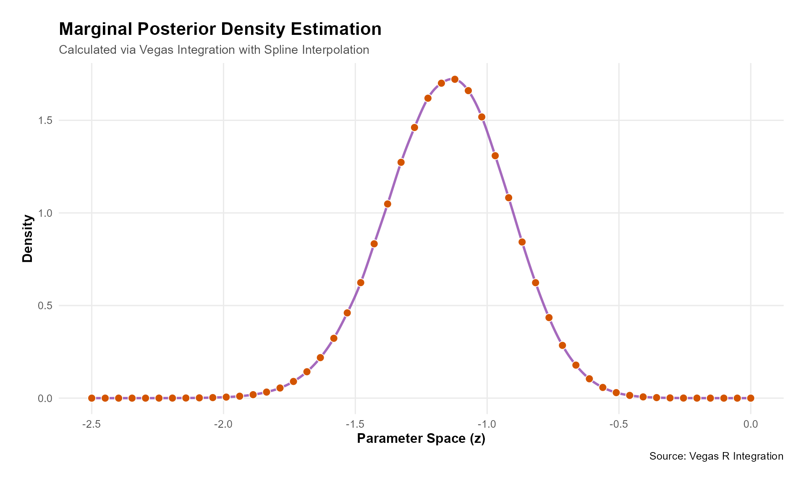

# Bayesian Posterior Densities

### Quickstart

11th-May-update: A first example of how to compute posterior density
using vegasr with integrand written as an R function. This will include
a comparison with stan (to be completed).

## Model Formulation

The model implemented here is a non-centered parameterization (helps
improve MCMC sampling) for a logistic model.

``` math

\begin{aligned}
\mu_0 &\sim \text{Normal}(0, 2.5)\\
\sigma_0 &\sim \text{Half-Normal}(0, 2.5) \\
\mu_1 &\sim \text{Normal}(0, 2.5) \\
\sigma_1 &\sim \text{Half-Normal}(0, 2.5) \\
\tilde{\theta}_j &\sim \text{Normal}(0, 1)\quad\enspace\text{for}\enspace{j=1,2}  \\
\beta_0 &= \mu_0 + \sigma_0 \tilde{\theta}_1 \\
\beta_1 &= \mu_1 + \sigma_1 \tilde{\theta}_2 \\
\text{logit(}{p_i}) &= \beta_0 + \beta_1 z_i\quad\quad\enspace\enspace\text{for}\enspace{i=1,\dots,N}  \\
y_i &\sim \text{Bernoulli}(p_i)
\end{aligned}
```
When using direct integration via Vegas we don’t need the non-centered
parameterization:

``` math

\begin{aligned}
\beta_0 &\sim \text{Normal}(\mu_0, \sigma_0) \\
\beta_1 &\sim \text{Normal}(\mu_1, \sigma_1) \\
\end{aligned}
```

### Data set

The R chunk below creates a simple dataset of three cols:

- a binary response variable y (0/1 = non-responder/responder),
- a (dummy) basket ID variable (=1)
- a binary treatment variable (0/1 = control/test treatment)

The basket ID is currently set fixed at 1, denoting there is only one
basket in this trial, i.e. a classical two arm randomized trial design.
Baskets will be added in other vignettes.

``` r
thedata<-vegasr:::fn_create_data_1(99999) # a list of y and treat as matrices
```

## 1. Construct Log Posterior Function

To use direct integration in Vegas the key parts are:

- define the prior density functions
- define the log likelihood + log priors

In addition, we also implement a **change of variables** to deal with
the range of integration going to $`\infty`$. This means we integrate
over transformed variables (see below) which have finite bounds. As we
are changing variables then this requires the usual Jacobian adjustment
to the function being integrated to ensure the volume being computed is
equivalent to that on the original scale.

To map a variable $`t\in(-1,1)`$ to $`x\in(-\infty,\infty)`$ we can use
the following function and it’s Jacobian (J):
``` math

\begin{aligned}
x&=&\frac{t}{1-t^2} \\
\\
\enspace\text{where } \quad\enspace J &=& \frac{1+t^2}{(1-t^2)^2}
\end{aligned}
```

The function below `compute_log_lik(theta, y,T)` is necessary to compute
the overall standardization constant - the constant which ensures the
posterior density integrates to unity - and the integration here is over
all parameters in the model. We work in log scale as much as possible
and a scaling \`\`trick’’ is used to help avoid numerical overflow.
These technical numerical details can be found in the full quarto file.

``` r
### Now use VEGAS
library(vegasr)
# now setup python environment
vegas_initialize() # this needed called once per session after library(vegas) 
#> successfully initialized vegas version: 6.4.1

result_logEv<-vegasBayesEvidence(f=vegasr:::fn_log_post_1,
              lower=c(-1,-1,-1,-1,0.0001,0.0001), 
              upper=c(1,1,1,1,1,1),
              nitn_warm = 10, neval_warm = 10000,
              nitn = 10, neval = 10000,
              errTol=1,maxIter=10,seed=99999,nsearch=10000,
              extra_args=list(
                y=thedata$y,treat=thedata$treat,shiftby=0,uselog=1.))
cat("log evidence = ",result_logEv,"\n")
#> log evidence =  -129.4318
```

## 2. Find Log Evidence

We use vegas to integrate over the log posterior to get the log
evidence, i.e. the standardization constant, that ensures the posterior
integrates to unity. Also known as the log marginal likelihood.

``` r

mymarg<-vegasBayesPosterior(f=vegasr:::fn_marg_1_1,
                           lower=c(-1,-1,-1,0.0001,0.0001),
                           upper=c(1,1,1,1,1),
                           nitn_warm = 10, neval_warm = 10000,
                           nitn = 10, neval = 10000,
                           errTol=1,maxIter=10,seed=99999,nsearch=10000,
                           log_evidence = result_logEv,
                           extra_args=list(
                             y=thedata$y,treat=thedata$treat,shiftby=0,uselog=1.,z=-1.))
cat("Marginal density f(z) at z = -1. = ",mymarg,"\n")
#> Marginal density f(z) at z = -1. =  1.436437
```

``` r

library(foreach)
#> Warning: package 'foreach' was built under R version 4.2.3
library(doParallel)
#> Warning: package 'doParallel' was built under R version 4.2.3
#> Loading required package: iterators
#> Warning: package 'iterators' was built under R version 4.2.3
#> Loading required package: parallel
library(extraDistr)
#> Warning: package 'extraDistr' was built under R version 4.2.3
library(tictoc)
#> Warning: package 'tictoc' was built under R version 4.2.3

cl <- makeCluster(n_cores)

registerDoParallel(cl)

myz<-seq(-2.5,-0.,len=no_den_pts)
tic("Parallel Vegas Loop") # Start timer with a label
f_z<-foreach(z= myz,.packages = c("extraDistr", "vegasr")) %dopar% {
 vegasBayesPosterior(f=vegasr:::fn_marg_1_1,
                      lower=c(-1,-1,-1,0.0001,0.0001),
                      upper=c(1,1,1,1,1),
                      nitn_warm = 10, neval_warm = 10000,
                      nitn = 10, neval = 10000,
                      errTol=1,maxIter=10,seed=99999,nsearch=10000,
                      log_evidence = result_logEv,
                      extra_args=list(
                        y=thedata$y,treat=thedata$treat,shiftby=0,uselog=1.,z=z))

 }

stopCluster(cl)
toc() # Stops timer and prints
#> Parallel Vegas Loop: 70.53 sec elapsed
```

``` r
# 3. Display the plot
# plotting code above in hidden chunk
print(p)
```


