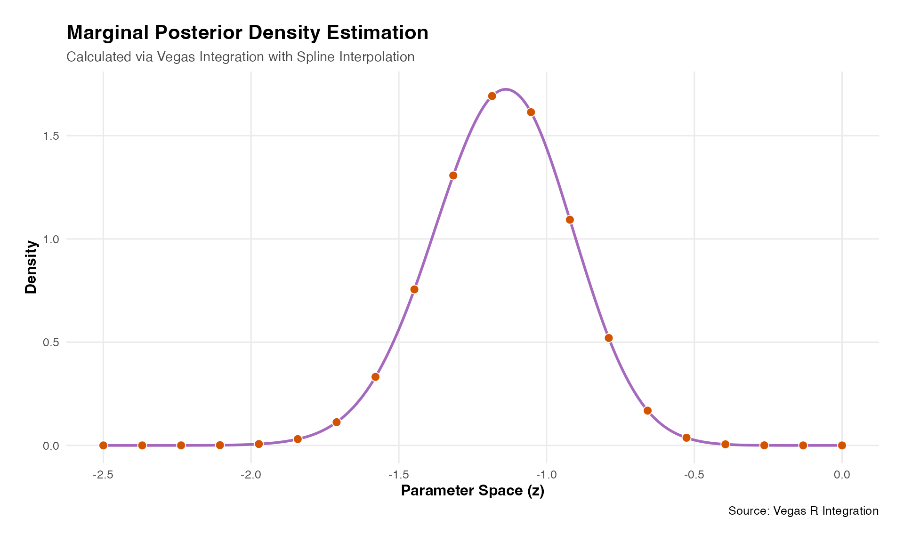

# Bayesian Posterior Densities using Vegas

## Quickstart

This is a first example of how to compute a Bayesian posterior density
using vegasr, with the integrand written as an R function. Examples of
how to use vegasr to compute general integrals can be found in the
?vegas help page. See the package vignettes for other integrands and how
to use Rcpp to write the integrand functions.

## Model Formulation

The model implemented here is a hierarchical Bayesian model with
logistic link function and single predictor denoting treatment effect:

``` math

\begin{aligned}
\mu_0 &\sim \text{Normal}(0, 2.5)\\
\sigma_0 &\sim \text{Half-Normal}(0, 2.5) \\
\mu_1 &\sim \text{Normal}(0, 2.5) \\
\sigma_1 &\sim \text{Half-Normal}(0, 2.5) \\
\beta_0 &\sim \text{Normal}(\mu_0, \sigma_0) \\
\beta_1 &\sim \text{Normal}(\mu_1, \sigma_1) \\
\text{logit(}{p_i}) &= \beta_0 + \beta_1 z_i\quad\quad\quad\quad\enspace\enspace\text{for}\enspace{i=1,\dots,N}  \\
y_i &\sim \text{Bernoulli}(p_i)
\end{aligned}
```

## Data set

The R chunk below creates a simple dataset of three cols:

- a binary response variable y (0/1 = non-responder/responder),
- a (dummy) basket ID variable (=1)
- a binary treatment variable (0/1 = control/test treatment)

The basket ID is currently set fixed at 1, denoting there is only one
basket in this trial, i.e. it’s a classical two arm randomized trial
design. Other examples in the package include five baskets.

``` r
thedata<-vegasr:::fn_create_data_1(99999) # a list of y and treat with both as matrices
```

## Construct Log Posterior Function

To use direct integration for Bayesian computation the key task is to:

- write a function that computes the log likelihood + log priors + log
  Jacobian

We recommend using a **change of variables** to deal with the ranges of
integration going to $`\infty`$ or $`-\infty`$. This means we integrate
over transformed variables (see below) which have finite bounds,
typically $`-1`$, $`0`$ or $`+1`$. As we are changing variables then
this requires the usual Jacobian adjustment to the function being
integrated to ensure the volume being computed is equivalent to that on
the original scale.

To map a variable $`t\in(-1,1)`$ to $`x\in(-\infty,\infty)`$ we can use
the following function and its Jacobian (J):
``` math

\begin{aligned}
x&=&\frac{t}{1-t^2} \\
\\
\enspace\text{where } \quad\enspace J &=& \frac{1+t^2}{(1-t^2)^2}
\end{aligned}
```

## Find Log Evidence

The function below `vegasr:::fn_log_post_1` returns the log posterior.
See ?fn_log_post_1 for specifics. The function
[`vegasBayesEvidence()`](https://fraseriainlewis.github.io/vegasr/reference/vegasBayesEvidence.md)
computes the log evidence, i.e. it integrates out all parameters in the
posterior `vegasr:::fn_log_post_1` to give the constant needed to
standardize the posterior to unity. Details of the parameters can be
found in ?vegasBayesEvidence.

``` r
### Now use VEGAS
library(vegasr)
# now setup python environment
vegas_initialize() # this needs called once per session after library(vegasr) 
#> successfully initialized vegas version: 6.4.1

result_logEv<-vegasBayesEvidence(f=vegasr:::fn_log_post_1,
              lower=c(-1,-1,-1,-1,0.0001,0.0001), 
              upper=c(1,1,1,1,1,1),
              nitn_warm = 10, neval_warm = 10000,
              nitn = 10, neval = 10000,
              errTol=1,maxIter=10,seed=99999,nsearch=10000,
              extra_args=list(
                y=thedata$y,treat=thedata$treat,shiftby=0,uselog=1.))
cat("log evidence = ",result_logEv,"\n")
#> log evidence =  -129.4318
```

## Compute the Marginal Density

We use
[`vegasBayesPosterior()`](https://fraseriainlewis.github.io/vegasr/reference/vegasBayesPosterior.md)
to compute a single density value on the marginal posterior density for
a single model parameter. This function takes as input a function for
log posterior for the model but where one dimension is now fixed (here
$`\beta_0`$ in the model above), i.e. the integrand has one less
dimension, e.g. `vegasr:::fn_log_post_1` is 6-D whereas
`vegasr:::fn_marg_1_1` below is 5-D and the 6th dimension is passed as a
fixed value, z.

``` r
# compute posterior marginal for intercept $\beta_0$ in the model where intercept = -1.
mymarg<-vegasBayesPosterior(f=vegasr:::fn_marg_1,
                           lower=c(-1,-1,-1,0.0001,0.0001),
                           upper=c(1,1,1,1,1),
                           nitn_warm = 10, neval_warm = 10000,
                           nitn = 10, neval = 10000,
                           errTol=1,maxIter=10,seed=99999,nsearch=10000,
                           log_evidence = result_logEv,
                           extra_args=list(
                             y=thedata$y,treat=thedata$treat,shiftby=0,uselog=1.,z=-1.))
cat("Marginal density f(z) at z = -1. = ",mymarg,"\n")
#> Marginal density f(z) at z = -1. =  1.436437
```

## Marginal Density over a Range

To compute the marginal posterior density over a range of z we iterate
across a grid of z values. This can easily be done using doParallel as
this is embarrassingly parallel - the computation of the posterior
density at each fixed value of z are independent.

``` r

if(!nzchar(Sys.getenv("_R_CHECK_PACKAGE_NAME_"))){
library(foreach)
library(doParallel)
library(extraDistr)
library(tictoc)

cl <- makeCluster(parallel::detectCores() - 1)

registerDoParallel(cl)
myz<-seq(-2.5,-0.,len=no_den_pts)
tic("Parallel Vegas Loop") # Start timer with a label
f_z<-foreach(z= myz,.packages = c("extraDistr", "vegasr")) %dopar% {
 vegasBayesPosterior(f=vegasr:::fn_marg_1,
                      lower=c(-1,-1,-1,0.0001,0.0001),
                      upper=c(1,1,1,1,1),
                      nitn_warm = 10, neval_warm = 10000,
                      nitn = 10, neval = 10000,
                      errTol=1,maxIter=10,seed=99999,nsearch=10000,
                      log_evidence = result_logEv,
                      extra_args=list(
                        y=thedata$y,treat=thedata$treat,shiftby=0,uselog=1.,z=z))

 }

stopCluster(cl)
toc() # Stops timer and prints
}
#> Loading required package: iterators
#> Loading required package: parallel
#> Parallel Vegas Loop: 8.124 sec elapsed
```

``` r
# 3. Display the plot
# plotting code above in hidden chunk
if(!nzchar(Sys.getenv("_R_CHECK_PACKAGE_NAME_"))){
print(p)
}
```


