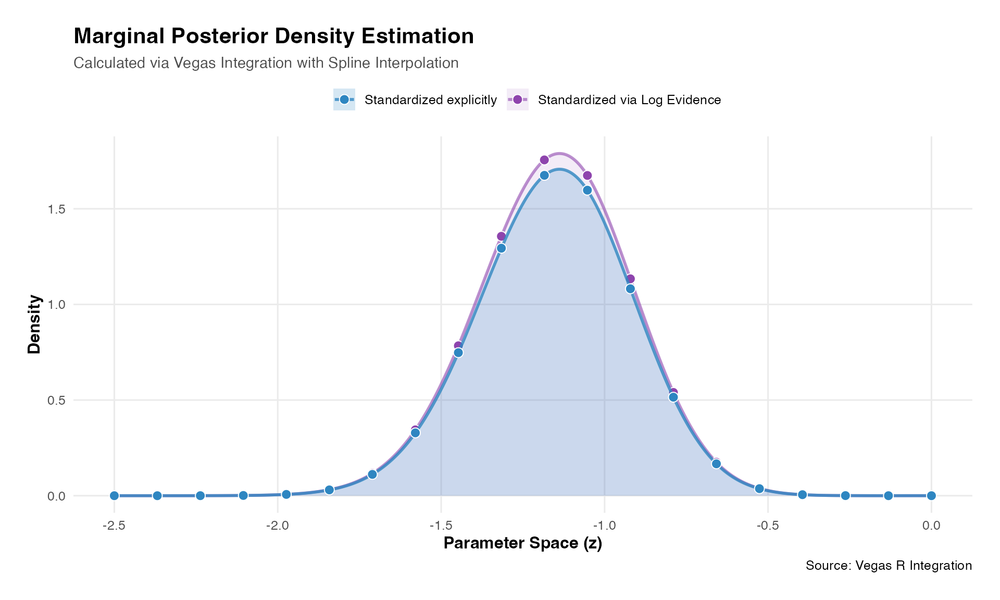

# Using Rcpp in Vegasr

## Quickstart

Using Rcpp libraries to write the log posterior function will almost
surely be faster, perhaps many times faster, than an R function even
when vectorized. Examples of the timing comparison are below.

Example log posterior functions are given below using two Rcpp linear
algebra libraries,
[RcppArmadillo](https://github.com/rcppcore/rcpparmadillo) and
[RcppEigen](https://github.com/RcppCore/RcppEigen). These libraries have
different pros and cons. RcppArmadillo has some built-in parallelization
(via OpenMP - not supported on MacOS) while RcppEigen does not, but both
are highly efficient in their own way. RcppEigen works well with
[RcppParallel](https://github.com/rcppcore/rcppparallel) which does not
use OpenMP and can be more problematic when used with RcppArmadillo.

## Model Formulation

The model implemented here is:

``` math

\begin{aligned}
\mu_0 &\sim \text{Normal}(0, 2.5)\\
\sigma_0 &\sim \text{Half-Normal}(0, 2.5) \\
\mu_1 &\sim \text{Normal}(0, 2.5) \\
\sigma_1 &\sim \text{Half-Normal}(0, 2.5) \\
\beta_0 &\sim \text{Normal}(\mu_0, \sigma_0) \\
\beta_1 &\sim \text{Normal}(\mu_1, \sigma_1) \\
\text{logit(}{p_i}) &= \beta_0 + \beta_1 z_i\quad\quad\quad\quad\enspace\enspace\text{for}\enspace{i=1,\dots,N}  \\
y_i &\sim \text{Bernoulli}(p_i)
\end{aligned}
```

## Data set

The R chunk below creates a simple dataset of three cols:

- a binary response variable y (0/1 = non-responder/responder),
- a (dummy) basket ID variable (=1)
- a binary treatment variable (0/1 = control/test treatment)

The basket ID is currently set fixed at 1, denoting there is only one
basket in this trial, i.e. a classical two arm randomized trial design.

``` r
library(vegasr)
vegas_initialize()
#> successfully initialized vegas version: 6.4.1
thedata<-vegasr:::fn_create_data_1(99999) # a list of y and treat as matrices
# this function is in vegasr/R/fn_internal.R
```

## Example of calling log posterior functions

These functions are available in the source package in fns_arma.cpp or
fns_eigen.cpp in /src. They implement the same log posterior integrand,
using different libraries, and the numerical output values should be the
same.

``` r
### Call the Rcpp functions to demonstrate correct input and output values

theta<- matrix(data=rep(0.1,length=4*6), ncol = 6) # dummy data - must be 6 cols, any number of rows

vegasr:::fn_log_post_1(theta, thedata$y, thedata$treat,.0, 1.0) # R function
#> [1] -145.933 -145.933 -145.933 -145.933
# this function is in vegasr/R/fn_internal.R

vegasr::arma_fn_log_post_1(theta, thedata$y, thedata$treat,0.0, 1.0) # Armadillo function
#>          [,1]
#> [1,] -145.933
#> [2,] -145.933
#> [3,] -145.933
#> [4,] -145.933
# this function is in vegasr/src/fns_arma.cpp

vegasr::eigen_fn_log_post_1(theta, thedata$y, thedata$treat,0.0, 1.0) # Eigen function
#> [1] -145.933 -145.933 -145.933 -145.933
# this function is in vegasr/src/fns_eigen.cpp
```

## Timing comparisons

Results below demonstrate the speed increase of Rcpp over plain R. An
approx x4 speed up is seen in this example on a like for like basis.
Using parallel computation additionally makes a big difference even in
this fairly simple case, with a bigger differential expected the more
complex the model. When computing marginal densities and/or integrands
in more than a few dimensions the speed of each individual function call
becomes increasing important as this will be called a large number of
times.

``` r
library(vegasr)
# now setup python environment
vegas_initialize() # this needed called once per session after library(vegas)
#> vegas is already initialized
#> NULL
library(tictoc) # easy timing

## pure R
tic("plain R")
result_logEv<-vegasBayesEvidence(f=vegasr:::fn_log_post_1,
                                 lower=c(-1,-1,-1,-1,0.0001,0.0001),
                                 upper=c(1,1,1,1,1,1),
                                 nitn_warm = 5, neval_warm = 1e5,
                                 nitn = 5, neval = 1e5,
                                 errTol=1,maxIter=10,seed=99999,nsearch=10000,
                                 extra_args=list(
                                   y=thedata$y,treat=thedata$treat,shiftby=0,uselog=1.))
toc()
#> plain R: 4.808 sec elapsed
cat("log evidence = ",result_logEv,"\n\n")
#> log evidence =  -129.4204

## Armadillo
tic("Armadillo")
result_logEv<-vegasBayesEvidence(f=vegasr:::arma_fn_log_post_1,
                                 lower=c(-1,-1,-1,-1,0.0001,0.0001),
                                 upper=c(1,1,1,1,1,1),
                                 nitn_warm = 5, neval_warm = 1e5,
                                 nitn = 5, neval = 1e5,
                                 errTol=1,maxIter=10,seed=99999,nsearch=10000,
                                 extra_args=list(
                                   y=thedata$y,treat=thedata$treat,shiftby=0,uselog=1.))
toc()
#> Armadillo: 1.426 sec elapsed
cat("log evidence = ",result_logEv,"\n\n")
#> log evidence =  -129.4204

## Eigen
tic("Eigen")
result_logEv<-vegasBayesEvidence(f=vegasr::eigen_fn_log_post_1,
                                 lower=c(-1,-1,-1,-1,0.0001,0.0001),
                                 upper=c(1,1,1,1,1,1),
                                 nitn_warm = 5, neval_warm = 1e5,
                                 nitn = 5, neval = 1e5,
                                 errTol=1,maxIter=10,seed=99999,nsearch=10000,
                                 extra_args=list(
                                   y=thedata$y,treat=thedata$treat,shiftby=0,uselog=1.))
toc()
#> Eigen: 1.023 sec elapsed
cat("log evidence = ",result_logEv,"\n\n")
#> log evidence =  -129.4204
result_logEv_keep<-result_logEv;

## Eigen with parallel
tic("Eigen and RcppParallel")
result_logEv<-vegasBayesEvidence(f=vegasr::eigen_fn_log_post_1_par,
                                 lower=c(-1,-1,-1,-1,0.0001,0.0001),
                                 upper=c(1,1,1,1,1,1),
                                 nitn_warm = 5, neval_warm = 1e5, #this is deliberately too small
                                 nitn = 5, neval = 1e5, #this is deliberately too small
                                 errTol=1,maxIter=10,seed=99999,nsearch=10000,
                                 extra_args=list(
                                   y=thedata$y,treat=thedata$treat,shiftby=0,uselog=1.))
toc()
#> Eigen and RcppParallel: 0.205 sec elapsed
cat("log evidence = ",result_logEv,"\n\n")
#> log evidence =  -129.4204
```

## Compute Marginal Posterior Density

An example using a parallel version of log posterior via Eigen and
RcppParallel libraries. See fns_eigen.cpp in /src in source package.

``` r
# Marginal density at a single point
tic()
mymarg<-vegasBayesPosterior(f=vegasr::eigen_fn_marg_1,
                            lower=c(-1,-1,-1,0.0001,0.0001),
                            upper=c(1,1,1,1,1),
                            nitn_warm = 10, neval_warm = 10000,
                            nitn = 10, neval = 10000,
                            errTol=1,maxIter=10,seed=99999,nsearch=10000,
                            log_evidence = result_logEv,
                            extra_args=list(
                              y=thedata$y,treat=thedata$treat,shiftby=0,uselog=1.,z=-1.))

cat("Marginal density f(z) at z = -1. = ",mymarg,"\n")
#> Marginal density f(z) at z = -1. =  1.420125
toc()
#> 0.045 sec elapsed

## Recompute Log Evidence - we did this above, but this is to show issues of accuracy
tic()
result_logEv<-vegasBayesEvidence(f=vegasr::eigen_fn_log_post_1_par,
                                 lower=c(-1,-1,-1,-1,0.0001,0.0001),
                                 upper=c(1,1,1,1,1,1),
                                 nitn_warm = 5, neval_warm = 1e3, #this is too small
                                 nitn = 5, neval = 1e3, #this is too small
                                 errTol=1,maxIter=10,seed=99999,nsearch=10000,
                                 extra_args=list(
                                   y=thedata$y,treat=thedata$treat,shiftby=0,uselog=1.))
#> Warnings: tolerance not met
toc()
#> 0.023 sec elapsed
cat("log evidence = ",result_logEv,"\n\n")
#> log evidence =  -129.4685

##################################
# compute marginal across a range
myz<-seq(-2.5,-0.,len=no_den_pts)
tic("") # Start timer with a label
f_z<-rep(0,length(myz));
i<-1;
for(z in myz){
  f_z[i]<-vegasBayesPosterior(f=vegasr::eigen_fn_marg_1,
                            lower=c(-1,-1,-1,0.0001,0.0001),
                            upper=c(1,1,1,1,1),
                            nitn_warm = 10, neval_warm = 10000,
                            nitn = 10, neval = 10000,
                            errTol=1,maxIter=10,seed=99999,nsearch=10000,
                            log_evidence = result_logEv,
                            extra_args=list(
                              y=thedata$y,treat=thedata$treat,shiftby=0,uselog=1.,z=z))
  i<-i+1
}

toc() # Stops timer and prints
#> : 0.935 sec elapsed
```

### Splines

While it is possible to compute a fine grid of density values for the
marginal this is typically wasteful and highly computationally
intensive. An alternative option is to compute a small set of accurate
density values and then apply spline interpolation - which will go
through each point - to give the complete density. This can then be
integrated to get necessary quantiles or other statistics of interest.

### Standardized using Log Evidence

The textbook way to compute the marginal density is to divide the
density values by the evidence, typically kept on log scales as long as
possible for numerical accuracy. We calculated the log_evidence above.
In practice this can sometimes result in poorly standardized densities,
i.e. do not integrate to unity, unless the log evidence is particularly
accurate (as small differences on log scale get magnified when scaling
the density) which can take a lot of computational effort. An
alternative is to standardize the marginal explicitly via integrating it
and dividing by its area, which is easy as its one-dimensional. This
approach is shown below.

Note that if the objective is not to estimate the full density but
rather estimation of a quantile, e.g., 2.5% point, then it may be more
efficient to compute the log evidence and then only a small set of
density points in the relevant tail of the marginal. See next section.

``` r
# explicitly standardize the posterior marginal
logun<-log(f_z)+result_logEv # revert back to unstandardizesd log density
f_z_un<-exp(logun) # back to unstand density
ff_interp <- splinefun(myz, as.matrix(f_z_un), method = "fmm") # fit fun to every point
evA<-integrate(ff_interp,min(myz),max(myz))$value # find area 
ff_z<-f_z_un/evA # divide by area to standardize marginal density
ff_interp <- splinefun(myz, as.matrix(ff_z), method = "fmm") # now
```

``` r
# 3. Display the plot
# plotting code above in hidden chunk
if(!nzchar(Sys.getenv("_R_CHECK_PACKAGE_NAME_"))){
print(p)
}
```



### Computed Tail Probabilities

Often we are not interested in the full marginal posterior but we do
want its tails, e.g. for 95% CI limits. Below shows simple example of
how to do this. We compute the marginal density for a small number of
points in the tail and as we known the log evidence we can use uniroot
to solve the necessary quantile.

``` r
##################################
# compute marginal across a range for just the tail
myz<-seq(-2.5,-1.6,len=10)
tic("") # Start timer with a label
f_z<-rep(0,length(myz));
i<-1;
for(z in myz){
  f_z[i]<-vegasBayesPosterior(f=vegasr::eigen_fn_marg_1,
                            lower=c(-1,-1,-1,0.0001,0.0001),
                            upper=c(1,1,1,1,1),
                            nitn_warm = 10, neval_warm = 10000,
                            nitn = 10, neval = 10000,
                            errTol=1,maxIter=10,seed=99999,nsearch=10000,
                            log_evidence = result_logEv_keep,
                            extra_args=list(
                              y=thedata$y,treat=thedata$treat,shiftby=0,uselog=1.,z=z))
  cat("i=",i," z=",z," fz=",f_z[i],"\n")
  i<-i+1
}
#> i= 1  z= -2.5  fz= 2.83255e-06 
#> i= 2  z= -2.4  fz= 1.498566e-05 
#> i= 3  z= -2.3  fz= 7.242119e-05 
#> i= 4  z= -2.2  fz= 0.0003245118 
#> i= 5  z= -2.1  fz= 0.001320631 
#> i= 6  z= -2  fz= 0.004822544 
#> i= 7  z= -1.9  fz= 0.01604977 
#> i= 8  z= -1.8  fz= 0.04733017 
#> i= 9  z= -1.7  fz= 0.1232311 
#> i= 10  z= -1.6  fz= 0.2804151

f_interp <- splinefun(myz, f_z, method = "fmm")
myF<-function(x,target){return(integrate(f_interp,min(myz),x)$value-target)}

lower25<-uniroot(f=myF,interval=c(-2.5,-1.6),target=0.025)$root
cat("\n\nLower 2.5% of Marginal Posterior = ", lower25,"\n")
#> 
#> 
#> Lower 2.5% of Marginal Posterior =  -1.62585
```
