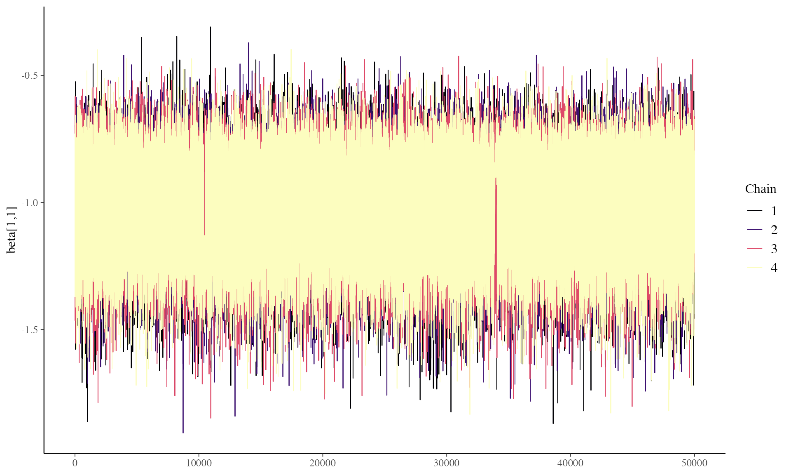
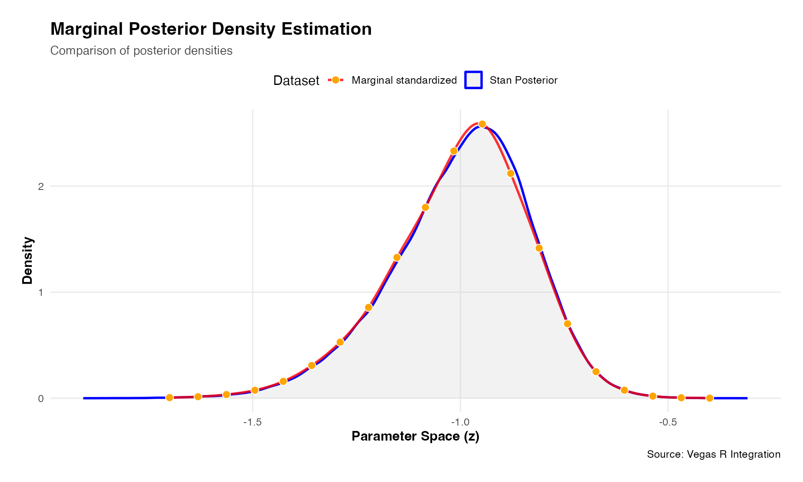

# Comparing Stan v Vegasr - Basket Trial

## Quickstart

This article is a more complex version of the vegasr vignette
[Rcpp](https://fraseriainlewis.github.io/vegasr/articles/rcpp.html)
where the hierarchical Bayesian model now being estimated is a basket
trial comprising of five baskets and binary response with logistic link
function. This model has 14 parameters. This article includes a
comparison with results from rstan.

## Model Formulation

The model implemented is given below where $`k`$ denotes the basket,
with $`\beta_{0,k}`$ and $`\beta_{1,k}`$ basket specific intercept and
slope terms.

\$\$ \begin{aligned} \mu_0 &\sim \text{Normal}(0, 2.5)\\ \sigma_0 &\sim
\text{Half-Normal}(0, 2.5) \\ \mu_1 &\sim \text{Normal}(0, 2.5) \\
\sigma_1 &\sim \text{Half-Normal}(0, 2.5) \\ \beta\_{0,k} &\sim
\text{Normal}(\mu_0,
\sigma_0)\hspace{0.95cm}\text{for}\enspace{k=0,\dots,4} \\ \beta\_{1,k}
&\sim \text{Normal}(\mu_1, \sigma_1)
\hspace{0.95cm}\text{for}\enspace{k=0,\dots,4}\\ \text{logit(}{p\_{i}})
&= \beta\_{0,k} + \beta\_{1,k}
z_i\hspace{1.49cm}\text{for}\enspace{i=1,\dots,N} \\ y_i &\sim
\text{Bernoulli}(p_i) \end{aligned} \$\$

## Data set

The R chunk below creates a simple dataset of three cols:

- a binary response variable y (0/1 = non-responder/responder),
- a basket ID variable (1,2,3,4,5)
- a binary treatment variable (0/1 = control/test treatment)

The basket ID is currently set fixed at 1, denoting there is only one
basket in this trial, i.e. it’s a classical two arm randomized trial
design.

``` r
library(vegasr)
vegas_initialize()
#> successfully initialized vegas version: 6.4.1
thedata<-vegasr:::fn_create_data_5(99999) # a list of y and treat as matrices
# this function is in vegasr/R/fn_internal.R
```

## Fit Model via MCMC using RStan

Below are code chunks that implement the above model in Stan using a
non-centralised parameterization (as recommended for Hamiltonian
samplers).

``` r
### Stan model
  BHM_stan_1 <- "data {
  int<lower = 0> K;                     // number of baskets (K >= 2)
  int<lower = 0> N;                     // total number of participants
  //int<lower = 0, upper = N> N_k[K];     // K x 1 vector of basket sample sizes
  //int<lower = 0, upper = N> N_k;
  int<lower = 1, upper = K> k_vec[N];   // N x 1 vector of basket indicators
  int<lower = 0, upper = 1> z_vec[N];   // N x 1 vector of treatment indicators for active treatment arm
  int<lower = 0, upper = 1> y[N];       // N x 1 vector of binary responses
}
parameters {
  matrix[K,2] beta_tr;                  // K x 2 matrix of transformed regression coefficients
  real mu1;                              // scalar of hierarchical mean (log odds ratio)
  real<lower = 0> sigma1;                  // scalar of hierarchical SD (log odds ratio)
  real mu0;                              // scalar of hierarchical mean (log odds ratio)
  real<lower = 0> sigma0;                  // scalar of hierarchical SD (log odds ratio)

}
transformed parameters {
  matrix[K,2] beta;                     // K x 2 matrix of regression coefficients (without transformation)
  // Calculate beta coefs using transformed betas (leads to better mixing)
  for (k in 1:K){
    beta[k,1] = mu0 + sigma0 * beta_tr[k,1];
    beta[k,2] = mu1 + sigma1 * beta_tr[k,2];
  }

}
model {
  mu0 ~ normal(0, 2.5);    // vectorized normal priors for hierarchical means (specify SD in normal distn)
  sigma0 ~ normal(0, 2.5);       // vectorized half-normal priors for hierarchical SDs (specify SD in normal distn)
  mu1 ~ normal(0, 2.5);    // vectorized normal priors for hierarchical means (specify SD in normal distn)
  sigma1 ~ normal(0, 2.5);       // vectorized half-normal priors for hierarchical SDs (specify SD in normal distn)
  beta_tr[,1] ~ normal(0, 1);  // vectorized normal prior for the log odds for the control arm
  beta_tr[,2] ~ normal(0, 1);  // vectorized normal prior for the log odds ratios
  for (i in 1:N)
    y[i] ~ bernoulli_logit(beta[k_vec[i], 1] + beta[k_vec[i], 2] * z_vec[i]);
}
"
```

``` r

# Create list with input values for Stan model
data_input_1 <- list(
  K = length(unique(thedata$basket)),                # number of subgroups
  N = length(thedata$basket),                # total sample size
  #N_k = N-k,            # sample size per basket
  k_vec = as.integer(thedata$basket),        # N x 1 vector of subgroup indicators
  z_vec =as.integer(thedata$treat),        # N x 1 vector of active treatment arm indicators
  y = as.integer(thedata$y)                 # N x 1 vector of binary responses
  )


### Compile and fit model
options(mc.cores = parallel::detectCores())
# Compile model (only run the line below once for a simulation study - compilation not dependent on any
# simulation inputs as defined by scenarios or on simulated data)
stan_mod_1 <- stan_model(model_code = BHM_stan_1)
# Fit model
nsamps <- 50000       # number of posterior samples (after removing burn-in) per chain
nburnin <- 5000       # number of burn-in samples to remove at beginning of each chain
nchains <- 4          # number of chains
#BHM_pars_1 <- c("beta","mu0", "sigma0","mu1", "sigma1", "beta","beta_tr")     # parameters to sample
start_time <- Sys.time()
stan_fit_2 <- sampling(stan_mod_1, data = data_input_1,
                       iter = nsamps + nburnin, warmup = nburnin, chains = nchains)
#> Warning: There were 1662 divergent transitions after warmup. See
#> https://mc-stan.org/misc/warnings.html#divergent-transitions-after-warmup
#> to find out why this is a problem and how to eliminate them.
#> Warning: Examine the pairs() plot to diagnose sampling problems
end_time <- Sys.time()
end_time - start_time
post_draws_2 <- as.matrix(stan_fit_2)           # posterior samples of each parameter
```

``` r
library(bayesplot)
color_scheme_set("viridisA")
p<-mcmc_trace(stan_fit_2,"beta[1,1]")
#ggsave("precomputed/vg2_traceplot1_stan.png", p)
print(p)
```



``` r
print(summary(stan_fit_2))
#> $summary
#>                       mean      se_mean        sd          2.5%           25%
#> beta_tr[1,1] -4.394529e-01 0.0043765156 0.8312719 -2.065909e+00 -9.810313e-01
#> beta_tr[1,2] -1.378014e-01 0.0052900123 0.7106123 -1.543279e+00 -5.926657e-01
#> beta_tr[2,1] -2.613851e-01 0.0050467615 0.8299188 -1.884570e+00 -8.007881e-01
#> beta_tr[2,2] -5.745307e-01 0.0036123810 0.7213440 -2.016319e+00 -1.039752e+00
#> beta_tr[3,1] -6.884666e-03 0.0052604314 0.8238505 -1.646272e+00 -5.376461e-01
#> beta_tr[3,2] -5.261294e-01 0.0034111669 0.7132516 -1.963326e+00 -9.828324e-01
#> beta_tr[4,1]  1.724061e-01 0.0035694392 0.8214178 -1.506044e+00 -3.506515e-01
#> beta_tr[4,2]  5.565207e-01 0.0082415942 0.7211884 -8.868103e-01  1.011073e-01
#> beta_tr[5,1]  5.311935e-01 0.0040790463 0.8536994 -1.252909e+00 -2.566764e-03
#> beta_tr[5,2]  7.131697e-01 0.0085600201 0.7456629 -7.918591e-01  2.411119e-01
#> mu1           8.743603e-01 0.0122563895 0.3173180  2.860290e-01  7.200081e-01
#> sigma1        4.621460e-01 0.0097457307 0.3616283  3.722716e-02  2.366993e-01
#> mu0          -9.032625e-01 0.0044998728 0.1741002 -1.238214e+00 -9.868795e-01
#> sigma0        2.174530e-01 0.0038657274 0.2153659  7.754836e-03  7.902152e-02
#> beta[1,1]    -9.971098e-01 0.0007999634 0.1676480 -1.365824e+00 -1.099041e+00
#> beta[1,2]     8.123872e-01 0.0008509017 0.2271100  3.614673e-01  6.634765e-01
#> beta[2,1]    -9.588116e-01 0.0005875927 0.1606617 -1.305105e+00 -1.056489e+00
#> beta[2,2]     6.372320e-01 0.0008269322 0.2426118  1.468543e-01  4.742021e-01
#> beta[3,1]    -9.025854e-01 0.0004712062 0.1518214 -1.212111e+00 -9.977218e-01
#> beta[3,2]     6.583691e-01 0.0007705161 0.2353673  1.758537e-01  5.018901e-01
#> beta[4,1]    -8.586909e-01 0.0004685004 0.1530947 -1.155177e+00 -9.585874e-01
#> beta[4,2]     1.098010e+00 0.0007549556 0.2363622  6.614135e-01  9.329071e-01
#> beta[5,1]    -7.801351e-01 0.0005801903 0.1707585 -1.081403e+00 -8.991626e-01
#> beta[5,2]     1.164655e+00 0.0010085161 0.2542495  6.965855e-01  9.830742e-01
#> lp__         -6.501784e+02 0.0165664146 3.4027305 -6.576760e+02 -6.522513e+02
#>                       50%           75%        97.5%       n_eff     Rhat
#> beta_tr[1,1]   -0.4494151    0.08758056    1.2602842  36076.8984 1.000197
#> beta_tr[1,2]   -0.1372304    0.31580807    1.2935081  18044.7982 1.000477
#> beta_tr[2,1]   -0.2719316    0.26904657    1.4145169  27042.4290 1.000191
#> beta_tr[2,2]   -0.5678925   -0.11295847    0.8446527  39874.7286 1.000223
#> beta_tr[3,1]   -0.0144557    0.52204656    1.6478203  24527.5489 1.000192
#> beta_tr[3,2]   -0.5153692   -0.06457848    0.8618470  43719.9427 1.000213
#> beta_tr[4,1]    0.1824230    0.70830161    1.7787572  52957.5891 1.000103
#> beta_tr[4,2]    0.5524558    1.01434021    2.0005197   7657.2894 1.000886
#> beta_tr[5,1]    0.5482704    1.09329416    2.1669442  43801.8740 1.000204
#> beta_tr[5,2]    0.7119731    1.18792952    2.1932262   7588.1420 1.000596
#> mu1             0.8701811    1.02007836    1.4522775    670.2923 1.007030
#> sigma1          0.3807510    0.58097274    1.4323016   1376.8798 1.003055
#> mu0            -0.8972392   -0.80931464   -0.5897304   1496.9176 1.003663
#> sigma0          0.1631417    0.28428896    0.7857308   3103.7829 1.001590
#> beta[1,1]      -0.9808979   -0.88076033   -0.7082378  43919.4113 1.000289
#> beta[1,2]       0.8146514    0.96188873    1.2606148  71238.3533 1.000137
#> beta[2,1]      -0.9476250   -0.85127684   -0.6669340  74760.4364 1.000044
#> beta[2,2]       0.6454157    0.80767538    1.0854483  86076.3717 1.000045
#> beta[3,1]      -0.9008665   -0.80524971   -0.6016971 103811.1910 1.000010
#> beta[3,2]       0.6670067    0.82299722    1.0923915  93310.1186 1.000073
#> beta[4,1]      -0.8629713   -0.76190264   -0.5441846 106782.6123 1.000025
#> beta[4,2]       1.0892600    1.25394262    1.5841428  98019.7042 1.000019
#> beta[5,1]      -0.7950390   -0.67209823   -0.4116531  86621.0556 1.000048
#> beta[5,2]       1.1575761    1.33722306    1.6759097  63555.7224 1.000197
#> lp__         -649.8711035 -647.75815436 -644.4183336  42188.8861 1.000071
#> 
#> $c_summary
#> , , chains = chain:1
#> 
#>               stats
#> parameter               mean        sd          2.5%           25%
#>   beta_tr[1,1] -4.160266e-01 0.8441711 -2.069657e+00   -0.96801945
#>   beta_tr[1,2] -1.523707e-01 0.7185768 -1.537782e+00   -0.62476996
#>   beta_tr[2,1] -2.489955e-01 0.8264696 -1.864414e+00   -0.79487777
#>   beta_tr[2,2] -5.880142e-01 0.7136567 -2.017212e+00   -1.05227223
#>   beta_tr[3,1] -1.401373e-03 0.8324002 -1.666996e+00   -0.54299535
#>   beta_tr[3,2] -5.342525e-01 0.7029159 -1.929693e+00   -0.99010339
#>   beta_tr[4,1]  1.854772e-01 0.8273453 -1.516957e+00   -0.34157430
#>   beta_tr[4,2]  5.239750e-01 0.7362921 -9.848015e-01    0.07069074
#>   beta_tr[5,1]  5.533808e-01 0.8524901 -1.230250e+00    0.02146335
#>   beta_tr[5,2]  6.849423e-01 0.7674553 -8.874995e-01    0.21254058
#>   mu1           9.146192e-01 0.4003007  3.135271e-01    0.72654803
#>   sigma1        4.895208e-01 0.4048974  3.743697e-02    0.24100404
#>   mu0          -9.195675e-01 0.2073459 -1.412034e+00   -0.99241268
#>   sigma0        2.241098e-01 0.2241324  7.944053e-03    0.07755619
#>   beta[1,1]    -9.991538e-01 0.1703648 -1.375992e+00   -1.10151981
#>   beta[1,2]     8.143183e-01 0.2309642  3.567460e-01    0.66309707
#>   beta[2,1]    -9.605359e-01 0.1613119 -1.308934e+00   -1.05823304
#>   beta[2,2]     6.352227e-01 0.2429924  1.461983e-01    0.47240443
#>   beta[3,1]    -9.033540e-01 0.1517295 -1.215421e+00   -0.99767099
#>   beta[3,2]     6.585884e-01 0.2342569  1.809377e-01    0.50179797
#>   beta[4,1]    -8.604578e-01 0.1527228 -1.157145e+00   -0.95882584
#>   beta[4,2]     1.101121e+00 0.2367752  6.595140e-01    0.93580250
#>   beta[5,1]    -7.810149e-01 0.1702586 -1.081493e+00   -0.89920384
#>   beta[5,2]     1.171165e+00 0.2556342  6.973925e-01    0.98859993
#>   lp__         -6.501581e+02 3.3809841 -6.575745e+02 -652.24089588
#>               stats
#> parameter                50%           75%        97.5%
#>   beta_tr[1,1]   -0.43423978    0.12506930    1.2850627
#>   beta_tr[1,2]   -0.14941854    0.30948101    1.2928352
#>   beta_tr[2,1]   -0.26419559    0.29259848    1.3734170
#>   beta_tr[2,2]   -0.58103782   -0.12863023    0.8043242
#>   beta_tr[3,1]   -0.01181842    0.55039552    1.6305141
#>   beta_tr[3,2]   -0.52949386   -0.07912474    0.8470714
#>   beta_tr[4,1]    0.19921893    0.73599467    1.7789933
#>   beta_tr[4,2]    0.53087215    0.99209080    1.9877977
#>   beta_tr[5,1]    0.57254404    1.12142494    2.1817395
#>   beta_tr[5,2]    0.69865672    1.17573608    2.1744759
#>   mu1             0.87725438    1.03318514    2.0480829
#>   sigma1          0.39029934    0.60499342    1.6826793
#>   mu0            -0.89973612   -0.81296804   -0.6025324
#>   sigma0          0.16398951    0.29093646    0.8907846
#>   beta[1,1]      -0.98123586   -0.88162257   -0.7085901
#>   beta[1,2]       0.81661154    0.96668884    1.2709246
#>   beta[2,1]      -0.94839575   -0.85279920   -0.6680415
#>   beta[2,2]       0.64479417    0.80504758    1.0850754
#>   beta[3,1]      -0.90161637   -0.80732900   -0.6023645
#>   beta[3,2]       0.66634969    0.82255482    1.0902631
#>   beta[4,1]      -0.86495442   -0.76382092   -0.5485874
#>   beta[4,2]       1.09433395    1.25872846    1.5858380
#>   beta[5,1]      -0.79661480   -0.67398013   -0.4114086
#>   beta[5,2]       1.16505492    1.34661569    1.6796776
#>   lp__         -649.85721477 -647.75175517 -644.3914741
#> 
#> , , chains = chain:2
#> 
#>               stats
#> parameter               mean        sd          2.5%           25%
#>   beta_tr[1,1]   -0.45443280 0.8294488 -2.082663e+00 -9.901305e-01
#>   beta_tr[1,2]   -0.13697368 0.7079156 -1.548891e+00 -5.876114e-01
#>   beta_tr[2,1]   -0.26778548 0.8294281 -1.879304e+00 -8.040506e-01
#>   beta_tr[2,2]   -0.57567797 0.7191047 -2.015639e+00 -1.037975e+00
#>   beta_tr[3,1]   -0.01368943 0.8221220 -1.652172e+00 -5.349127e-01
#>   beta_tr[3,2]   -0.52904513 0.7163014 -1.974009e+00 -9.892537e-01
#>   beta_tr[4,1]    0.16791371 0.8179994 -1.503141e+00 -3.506579e-01
#>   beta_tr[4,2]    0.56333986 0.7132975 -8.262161e-01  1.063273e-01
#>   beta_tr[5,1]    0.52763136 0.8500523 -1.228392e+00 -4.695451e-03
#>   beta_tr[5,2]    0.72198321 0.7380157 -7.466531e-01  2.473707e-01
#>   mu1             0.86634814 0.2650524  3.041000e-01  7.209881e-01
#>   sigma1          0.44617877 0.3255561  3.588584e-02  2.354623e-01
#>   mu0            -0.89513665 0.1535835 -1.199832e+00 -9.844187e-01
#>   sigma0          0.21065025 0.1908896  8.014339e-03  8.028380e-02
#>   beta[1,1]      -0.99701902 0.1660256 -1.361512e+00 -1.098363e+00
#>   beta[1,2]       0.81282449 0.2260026  3.636012e-01  6.633512e-01
#>   beta[2,1]      -0.95787933 0.1595747 -1.300255e+00 -1.054474e+00
#>   beta[2,2]       0.63749806 0.2422310  1.451842e-01  4.751220e-01
#>   beta[3,1]      -0.90243384 0.1517444 -1.208031e+00 -9.989182e-01
#>   beta[3,2]       0.65975944 0.2352155  1.783415e-01  5.034760e-01
#>   beta[4,1]      -0.85752950 0.1539282 -1.154085e+00 -9.581310e-01
#>   beta[4,2]       1.09607557 0.2359915  6.602057e-01  9.312837e-01
#>   beta[5,1]      -0.77976442 0.1708031 -1.080450e+00 -8.990114e-01
#>   beta[5,2]       1.16241311 0.2525891  6.975285e-01  9.832312e-01
#>   lp__         -650.18206072 3.3721309 -6.575797e+02 -6.522615e+02
#>               stats
#> parameter                50%           75%        97.5%
#>   beta_tr[1,1]   -0.46221681    0.06678911    1.2596091
#>   beta_tr[1,2]   -0.13991571    0.31691771    1.2799573
#>   beta_tr[2,1]   -0.27858646    0.25703766    1.4277592
#>   beta_tr[2,2]   -0.57006096   -0.11287929    0.8417845
#>   beta_tr[3,1]   -0.02317526    0.50499843    1.6670209
#>   beta_tr[3,2]   -0.51321957   -0.06310969    0.8672591
#>   beta_tr[4,1]    0.17592343    0.69608784    1.7811422
#>   beta_tr[4,2]    0.55144860    1.01519158    2.0091145
#>   beta_tr[5,1]    0.54017309    1.08120324    2.1649908
#>   beta_tr[5,2]    0.71293545    1.19661351    2.1922929
#>   mu1             0.87113567    1.01808147    1.3973475
#>   sigma1          0.37605205    0.57029305    1.2840716
#>   mu0            -0.89565841   -0.80740924   -0.5884833
#>   sigma0          0.16308759    0.28211522    0.7174116
#>   beta[1,1]      -0.98208764   -0.88134819   -0.7081095
#>   beta[1,2]       0.81603217    0.96242273    1.2588720
#>   beta[2,1]      -0.94719003   -0.85114479   -0.6664987
#>   beta[2,2]       0.64606939    0.80776192    1.0823854
#>   beta[3,1]      -0.90104770   -0.80501830   -0.6024878
#>   beta[3,2]       0.66902529    0.82427586    1.0935918
#>   beta[4,1]      -0.86197103   -0.76042496   -0.5408835
#>   beta[4,2]       1.08666506    1.25085365    1.5834474
#>   beta[5,1]      -0.79410635   -0.67113794   -0.4116753
#>   beta[5,2]       1.15464458    1.33294652    1.6728081
#>   lp__         -649.89168091 -647.78085165 -644.4586994
#> 
#> , , chains = chain:3
#> 
#>               stats
#> parameter               mean        sd          2.5%           25%
#>   beta_tr[1,1] -4.444174e-01 0.8254902 -2.050845e+00 -9.846667e-01
#>   beta_tr[1,2] -1.268457e-01 0.7089505 -1.549177e+00 -5.772455e-01
#>   beta_tr[2,1] -2.653112e-01 0.8401841 -1.926786e+00 -8.061872e-01
#>   beta_tr[2,2] -5.603094e-01 0.7279661 -2.024943e+00 -1.027696e+00
#>   beta_tr[3,1] -1.780544e-03 0.8190144 -1.616795e+00 -5.326441e-01
#>   beta_tr[3,2] -5.133049e-01 0.7136419 -1.955337e+00 -9.685271e-01
#>   beta_tr[4,1]  1.653944e-01 0.8242161 -1.517979e+00 -3.602367e-01
#>   beta_tr[4,2]  5.699902e-01 0.7163436 -8.586033e-01  1.120515e-01
#>   beta_tr[5,1]  5.314450e-01 0.8543239 -1.243974e+00 -8.628079e-03
#>   beta_tr[5,2]  7.228724e-01 0.7375789 -7.558742e-01  2.530196e-01
#>   mu1           8.536489e-01 0.3035152  2.330748e-01  7.133073e-01
#>   sigma1        4.631331e-01 0.3670245  3.754843e-02  2.374253e-01
#>   mu0          -9.000148e-01 0.1656531 -1.222615e+00 -9.850917e-01
#>   sigma0        2.162164e-01 0.2174763  7.607021e-03  7.915316e-02
#>   beta[1,1]    -9.957726e-01 0.1665494 -1.364201e+00 -1.097239e+00
#>   beta[1,2]     8.104235e-01 0.2267605  3.576408e-01  6.617207e-01
#>   beta[2,1]    -9.580743e-01 0.1623193 -1.309082e+00 -1.055876e+00
#>   beta[2,2]     6.363076e-01 0.2436299  1.424050e-01  4.725603e-01
#>   beta[3,1]    -9.013036e-01 0.1522679 -1.210034e+00 -9.965832e-01
#>   beta[3,2]     6.548077e-01 0.2361570  1.692542e-01  4.971035e-01
#>   beta[4,1]    -8.585588e-01 0.1532938 -1.155566e+00 -9.588119e-01
#>   beta[4,2]     1.097991e+00 0.2371003  6.636213e-01  9.310495e-01
#>   beta[5,1]    -7.793007e-01 0.1703690 -1.079974e+00 -8.977962e-01
#>   beta[5,2]     1.162725e+00 0.2541048  6.961483e-01  9.807171e-01
#>   lp__         -6.501802e+02 3.4156032 -6.577435e+02 -6.522458e+02
#>               stats
#> parameter                50%           75%        97.5%
#>   beta_tr[1,1] -4.542164e-01    0.07615793    1.2536873
#>   beta_tr[1,2] -1.236911e-01    0.32377160    1.3003747
#>   beta_tr[2,1] -2.733732e-01    0.26942038    1.4242378
#>   beta_tr[2,2] -5.512497e-01   -0.09658998    0.8708243
#>   beta_tr[3,1] -5.630546e-03    0.52593394    1.6416661
#>   beta_tr[3,2] -5.071995e-01   -0.04900033    0.8700824
#>   beta_tr[4,1]  1.790506e-01    0.70602131    1.7738589
#>   beta_tr[4,2]  5.657605e-01    1.02677549    2.0029370
#>   beta_tr[5,1]  5.499575e-01    1.09808520    2.1647709
#>   beta_tr[5,2]  7.167137e-01    1.19123741    2.1984195
#>   mu1           8.641858e-01    1.01300152    1.4129009
#>   sigma1        3.826996e-01    0.58040163    1.4177030
#>   mu0          -8.971559e-01   -0.80761759   -0.5923963
#>   sigma0        1.612598e-01    0.28086706    0.7772267
#>   beta[1,1]    -9.797951e-01   -0.88093477   -0.7078314
#>   beta[1,2]     8.138708e-01    0.95883419    1.2570932
#>   beta[2,1]    -9.476596e-01   -0.84957521   -0.6631211
#>   beta[2,2]     6.423606e-01    0.80795162    1.0854090
#>   beta[3,1]    -9.000407e-01   -0.80307254   -0.5979571
#>   beta[3,2]     6.649920e-01    0.82122531    1.0898692
#>   beta[4,1]    -8.629054e-01   -0.76166491   -0.5422713
#>   beta[4,2]     1.088607e+00    1.25431892    1.5851586
#>   beta[5,1]    -7.943810e-01   -0.67283977   -0.4123280
#>   beta[5,2]     1.157136e+00    1.33529981    1.6749685
#>   lp__         -6.498768e+02 -647.74560806 -644.4199829
#> 
#> , , chains = chain:4
#> 
#>               stats
#> parameter               mean        sd          2.5%           25%
#>   beta_tr[1,1]   -0.44293502 0.8253719 -2.059964e+00   -0.98090838
#>   beta_tr[1,2]   -0.13501561 0.7067255 -1.534362e+00   -0.58345547
#>   beta_tr[2,1]   -0.26344837 0.8233930 -1.876622e+00   -0.79894500
#>   beta_tr[2,2]   -0.57412112 0.7243220 -2.010793e+00   -1.04131475
#>   beta_tr[3,1]   -0.01066732 0.8217566 -1.647300e+00   -0.54014463
#>   beta_tr[3,2]   -0.52791518 0.7198865 -1.990970e+00   -0.97970916
#>   beta_tr[4,1]    0.17083894 0.8159356 -1.485235e+00   -0.35083324
#>   beta_tr[4,2]    0.56877778 0.7176192 -8.646555e-01    0.11391403
#>   beta_tr[5,1]    0.51231695 0.8574354 -1.299059e+00   -0.01546063
#>   beta_tr[5,2]    0.72288101 0.7384751 -7.653901e-01    0.24853017
#>   mu1             0.86282495 0.2791180  2.879423e-01    0.72003856
#>   sigma1          0.44975133 0.3425104  3.819111e-02    0.23310797
#>   mu0            -0.89833087 0.1638822 -1.218172e+00   -0.98601641
#>   sigma0          0.21883546 0.2268666  7.502467e-03    0.07897442
#>   beta[1,1]      -0.99649396 0.1676048 -1.362536e+00   -1.09930449
#>   beta[1,2]       0.81198247 0.2246532  3.657577e-01    0.66558798
#>   beta[2,1]      -0.95875709 0.1594136 -1.302123e+00   -1.05732484
#>   beta[2,2]       0.63989961 0.2415711  1.525038e-01    0.47673471
#>   beta[3,1]      -0.90325006 0.1515387 -1.215333e+00   -0.99750505
#>   beta[3,2]       0.66032084 0.2358031  1.758031e-01    0.50525924
#>   beta[4,1]      -0.85821767 0.1524189 -1.153769e+00   -0.95830004
#>   beta[4,2]       1.09685282 0.2355546  6.637959e-01    0.93302606
#>   beta[5,1]      -0.78046029 0.1716000 -1.084159e+00   -0.90060923
#>   beta[5,2]       1.16231731 0.2545570  6.960547e-01    0.97981350
#>   lp__         -650.19318486 3.4417557 -6.578434e+02 -652.25953613
#>               stats
#> parameter                50%           75%        97.5%
#>   beta_tr[1,1]   -0.44659845    0.08093725    1.2434250
#>   beta_tr[1,2]   -0.13504738    0.31418660    1.2949258
#>   beta_tr[2,1]   -0.27089785    0.25897969    1.4262778
#>   beta_tr[2,2]   -0.56897758   -0.11243998    0.8578990
#>   beta_tr[3,1]   -0.01646781    0.50911221    1.6515380
#>   beta_tr[3,2]   -0.50962729   -0.06665712    0.8656670
#>   beta_tr[4,1]    0.17790004    0.69732345    1.7800584
#>   beta_tr[4,2]    0.56158527    1.02349160    2.0039518
#>   beta_tr[5,1]    0.53136993    1.07170875    2.1574292
#>   beta_tr[5,2]    0.71813999    1.18734817    2.2116753
#>   mu1             0.86920842    1.01689251    1.4025355
#>   sigma1          0.37490837    0.57019952    1.3371584
#>   mu0            -0.89648583   -0.80894556   -0.5761773
#>   sigma0          0.16413359    0.28337996    0.7676410
#>   beta[1,1]      -0.98036326   -0.87909098   -0.7084083
#>   beta[1,2]       0.81245877    0.95958187    1.2561692
#>   beta[2,1]      -0.94721273   -0.85123215   -0.6707343
#>   beta[2,2]       0.64868843    0.80953591    1.0894345
#>   beta[3,1]      -0.90079077   -0.80570869   -0.6043672
#>   beta[3,2]       0.66848876    0.82400722    1.0956448
#>   beta[4,1]      -0.86186803   -0.76203866   -0.5446075
#>   beta[4,2]       1.08714619    1.25172247    1.5826408
#>   beta[5,1]      -0.79532107   -0.67083123   -0.4115105
#>   beta[5,2]       1.15406066    1.33321598    1.6753974
#>   lp__         -649.85928630 -647.75341471 -644.4021863
```

## Example of calling log posterior functions

These functions are available in the source package in fns_arma.cpp or
fns_eigen.cpp in /src.

``` r
### Call the Rcpp functions to demonstrate correct input and output values

theta   <- matrix(data=rep(0.1,length=4*14), ncol = 14) # 5 intercept + 5 slope + 4 hyper
theta<-jitter(theta)

vegasr::eigen_fn_log_post_2(theta, thedata$y, thedata$treat, thedata$basket,0.0, 1.0)
```

## Log Evidence

As in the Rcpp vignette estimating the log evidence is not essential but
we compute for completeness, also to a high precision.

``` r
library(vegasr)
vegas_initialize()
#> vegas is already initialized
#> NULL
library(tictoc)
K <- length(unique(thedata$basket))
lower <- c(rep(-0.9999, 2*K), -0.9999, -0.9999, 1e-4, 1e-4)
upper <- c(rep( 0.9999, 2*K),  0.9999,  0.9999,   0.9999,   0.9999)

tic()
result_logEv <- vegasBayesEvidence(
  f = vegasr::eigen_fn_log_post_2_par,
  lower = lower, upper = upper,
  nitn_warm = 10, neval_warm = 100000,
  nitn = 10, neval = 100000,
  errTol = 0.1, maxIter = 20, seed = 99999, nsearch = 100000,
  extra_args=list(
    y=thedata$y,
    treat=thedata$treat,
    basket = thedata$basket,
    shiftby=0,uselog=1.)
)
#> Warnings: tolerance not met
cat("log evidence = ",result_logEv,"\n")
#> log evidence =  -655.4606
toc()
#> 202.451 sec elapsed
```

## 2. Find Marginal

Example using parallel version of log posterior using Eigen library. See
fns_eigen.cpp in /src in source package.

``` r
tic()
mymarg<-vegasBayesPosterior(f=vegasr::eigen_fn_marg_2,
                            lower=lower[-1],
                            upper=upper[-1],
                            nitn_warm = 10, neval_warm = 50000,
                            nitn = 10, neval = 50000,
                            errTol=1,maxIter=5,seed=99999,nsearch=10000,
                            log_evidence = result_logEv,
                            extra_args=list(
                              y=thedata$y,
                              treat=thedata$treat,
                              basket = thedata$basket,
                              shiftby=0,uselog=1.,z=-0.98))
cat("Marginal density f(z) at z = -0.1 = ",mymarg,"\n")
toc()
```

``` r
#result_logEv<-0.0
#myz<-c(seq(-1.7,-1.21,len=25),seq(-1.2,-0.7,len=50),seq(-0.69,-0.4,len=25))

library(vegasr)
vegas_initialize()
#> vegas is already initialized
#> NULL
library(tictoc)
K <- length(unique(thedata$basket))
lower <- c(rep(-0.9999, 2*K), -0.9999, -0.9999, 1e-4, 1e-4)
upper <- c(rep( 0.9999, 2*K),  0.9999,  0.9999,   0.9999,   0.9999)


myz<-c(seq(-1.7,-0.4,len=20))

tic("") # Start timer with a label
f_z<-rep(0,length(myz));
i<-1;
for(z in myz){
  f_z[i]<-vegasBayesPosterior(f=vegasr::eigen_fn_marg_2,
                            lower=lower[-1],
                            upper=upper[-1],
                            nitn_warm = 20, neval_warm = 50000,
                            nitn = 10, neval = 50000,
                            errTol=1,maxIter=20,seed=99999,nsearch=10000,
                            log_evidence = result_logEv,
                            extra_args=list(
                              y=thedata$y,
                              treat=thedata$treat,
                              basket = thedata$basket,
                              shiftby=0,uselog=1.,z=z))
  cat("i=",i," z=",z," fz=",f_z[i],"\n")
  i<-i+1
}
#> i= 1  z= -1.7  fz= 0.006123357 
#> i= 2  z= -1.631579  fz= 0.01521207 
#> i= 3  z= -1.563158  fz= 0.03718462 
#> i= 4  z= -1.494737  fz= 0.08031678 
#> i= 5  z= -1.426316  fz= 0.1701643 
#> i= 6  z= -1.357895  fz= 0.3295916 
#> i= 7  z= -1.289474  fz= 0.5644096 
#> i= 8  z= -1.221053  fz= 0.9140119 
#> i= 9  z= -1.152632  fz= 1.417736 
#> i= 10  z= -1.084211  fz= 1.922016 
#> i= 11  z= -1.015789  fz= 2.489716 
#> i= 12  z= -0.9473684  fz= 2.761081 
#> i= 13  z= -0.8789474  fz= 2.26366 
#> i= 14  z= -0.8105263  fz= 1.511716 
#> i= 15  z= -0.7421053  fz= 0.749828 
#> i= 16  z= -0.6736842  fz= 0.2673505 
#> i= 17  z= -0.6052632  fz= 0.08076424 
#> i= 18  z= -0.5368421  fz= 0.02100804 
#> i= 19  z= -0.4684211  fz= 0.005025982 
#> i= 20  z= -0.4  fz= 0.001081593

toc() # Stops timer and prints
#> : 39.059 sec elapsed
```

``` r
logun<-log(f_z)+result_logEv # back to unstand log density
f_z_un<-exp(logun) # back to unstand density
ff_interp <- splinefun(myz, as.matrix(f_z_un), method = "fmm") # fit fun to every point
evA<-integrate(ff_interp,min(myz),max(myz))$value # find area 
ff_z<-f_z_un/evA # divide by area to standardize marginal density
ff_interp <- splinefun(myz, as.matrix(ff_z), method = "fmm") # now

#plot(myz,predict(loess(ff_z ~ myz, span = 0.1,family="g",from=min(myz),to=max(myz))))
```

## Comparison with RStan

We compare one of the marginal densities, for $`\beta_{0,0}`$. These are
very similar, as expected. One of the open questions is how to compare
these two approaches in terms of numerical speed and accuracy, as both
are approximations, and each gets better with more samples (e.g. n_eff
in rstan output and neval parameter in vegas).

``` r
# 3. Display the plot
# plotting code above in hidden chunk
#if(!nzchar(Sys.getenv("_R_CHECK_PACKAGE_NAME_"))){
print(p)
```



``` r
#}
```
